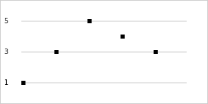
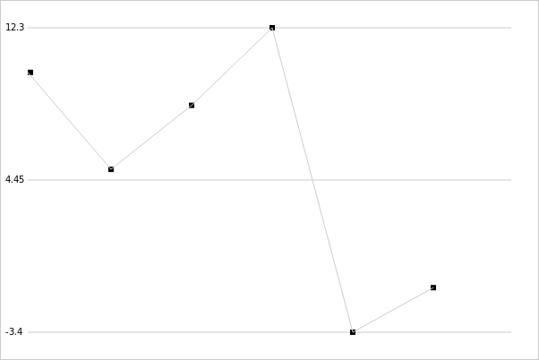

uchart
======

A microscopic js charting library.

I was in need of a very basic js charting library. I couldn't find one to meet my needs, so I wrote this one.

This library is very small. It currently comes in at under 500 bytes minified.

Usage
-----

```js
uchart(canvas_element, data)
```

Example
-------

```js
uchart(document.querySelector('canvas'), [1,3,5,4,3])
```



```js
uchart(document.querySelector('canvas'), [10,5,8.3,12.3,-3.4,-1.1], line=true)
```


